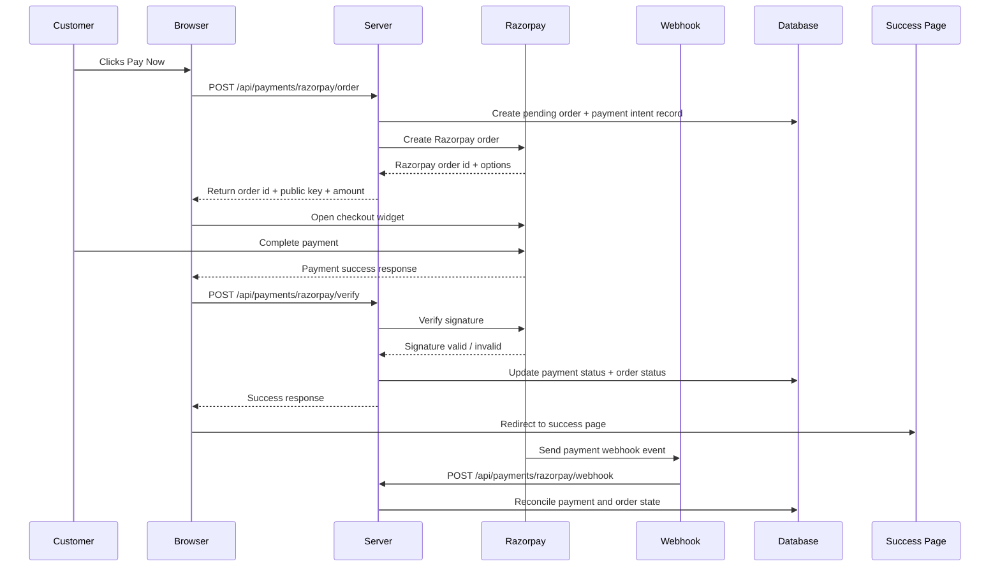

# Razorpay Integration Plan

## Current Checkout Flow

The current checkout flow is a simple client-driven order creation flow:

1. Customer adds products to the cart in the Zustand-based cart store.
2. The customer opens the cart page and clicks “Proceed to Checkout”.
3. The checkout page loads the user’s saved addresses from the profile API.
4. The customer selects a delivery address and a payment method.
5. The checkout page validates the selected payment details locally for UPI or card-style inputs.
6. When the customer clicks “Place Order”, the browser sends a POST request to /api/orders with:
   - shippingAddressId
   - paymentMethod
   - cart items with productId, quantity, and price
7. The server route /api/orders verifies the user session, validates the address, checks product stock, calculates totals, creates an order record, decrements stock, and clears the cart.
8. The order is stored with paymentStatus = PENDING and orderStatus = CONFIRMED in the current implementation.
9. The user is redirected to the order success page.

Important limitation: there is no real payment gateway integration today. The checkout flow currently creates an order as if payment were already completed, which is not suitable for production commerce.

## Proposed Razorpay Flow

Razorpay should be introduced as the actual payment gateway between order creation and order fulfillment.

Recommended lifecycle:

1. Customer reaches checkout and selects an address.
2. The browser submits the checkout payload to a new server endpoint that creates a pending order and a Razorpay order intent.
3. The server creates a DB record for the order in a pending/payment-pending state.
4. The server calls Razorpay Orders API to create a Razorpay order with:
   - amount
   - currency
   - receipt / order id
   - payment capture mode
5. The server returns the Razorpay order id, key id, and amount to the browser.
6. The browser opens the Razorpay Checkout widget using the public key and the order id.
7. The customer completes the payment on Razorpay.
8. Razorpay sends the payment result back to the browser.
9. The browser calls a server-side verification endpoint with the Razorpay payment id, order id, and signature.
10. The server verifies the signature using the Razorpay secret.
11. If verification succeeds, the server updates the order and payment status in the database and marks the order as paid.
12. The server redirects the user to the success page.
13. Razorpay sends a webhook event for payment status updates, and the server reconciles the payment state from the webhook as the source of truth.

This flow ensures that payment is verified server-side before the order is treated as completed.

## Database Changes

The existing Prisma schema already has the foundations for orders, addresses, and payment-related enums, but it needs to be extended.

### 1. Modify the Order model
Add the following fields to the Order model:

- razorpayOrderId: String?  
  Stores the Razorpay order id generated for the payment intent.

- razorpayPaymentId: String?  
  Stores the Razorpay payment id after successful payment.

- razorpaySignature: String?  
  Stores the signature returned by Razorpay for verification auditing.

- paymentAmount: Float?  
  Stores the amount captured by Razorpay.

- currency: String?  
  Stores the payment currency, typically INR.

- paymentCapturedAt: DateTime?  
  Stores when the payment was successfully captured.

- gatewayReference: String?  
  Stores the provider reference used for reconciliation.

- paymentMetadata: Json?  
  Optional JSON for storing gateway metadata.

### 2. Modify the PaymentStatus enum
Current enum values are:
- PENDING
- COMPLETED
- FAILED
- REFUNDED

Add or expand values to support the payment lifecycle more clearly:
- INITIATED
- AUTHORIZED
- CAPTURED
- FAILED
- CANCELLED
- PENDING
- REFUNDED

### 3. Modify the PaymentMethod enum
Current enum values include UPI, CREDIT_CARD, DEBIT_CARD, CASH_ON_DELIVERY, WALLET.

Add:
- RAZORPAY

### 4. Add a new PaymentTransaction model
A dedicated model is strongly recommended for auditable payment events.

Suggested fields:
- id: String
- orderId: String
- razorpayOrderId: String?
- razorpayPaymentId: String?
- razorpayEventId: String?
- eventType: String
- status: String
- amount: Float?
- currency: String?
- payload: Json?
- createdAt: DateTime
- updatedAt: DateTime

This model will make idempotency and webhook reconciliation much easier.

### 5. Optional: add a PaymentAttempt model
If the team wants precise retry tracking, a PaymentAttempt model can store:
- orderId
- attemptNumber
- status
- createdAt
- updatedAt
- failureReason

This is optional but useful for analytics and support.

## API Routes

The following new endpoints should be added.

### 1. POST /api/payments/razorpay/order
Purpose:
- Validate the authenticated user
- Validate the checkout payload
- Create or prepare the order in the database
- Generate a Razorpay order intent
- Return the Razorpay order id and public key to the browser

### 2. POST /api/payments/razorpay/verify
Purpose:
- Receive Razorpay payment response data from the browser
- Verify the signature server-side
- Update the order and payment status in the database
- Return success or failure to the client

### 3. POST /api/payments/razorpay/webhook
Purpose:
- Receive Razorpay webhook events
- Verify webhook signature
- Update payment state and order state from the event
- Prevent duplicate processing using idempotency logic

### 4. Optional: GET /api/payments/razorpay/status
Purpose:
- Allow the frontend or support tools to inspect the current payment state for a specific order

## Payment Verification

Signature verification is the most important server-side step.

### How it works
Razorpay sends a signature for the payment response. The server must verify it before treating the payment as successful.

The verification string is built as:

- order_id + "|" + payment_id

The server computes:

- HMAC SHA256 of the concatenated string using the Razorpay secret

Then it compares the computed digest to the signature provided by Razorpay.

### Recommended implementation logic
1. Receive order id, payment id, and signature from the browser.
2. Retrieve the corresponding order from the database.
3. Confirm the order has a stored Razorpay order id matching the request.
4. Compute the expected signature using the Razorpay secret.
5. If the signature matches, mark the payment as captured/verified.
6. If it does not match, mark the payment as failed or tampered.

### Important notes
- Verification must happen on the server, never in the browser.
- The client should never receive or use the secret key.
- The order should not be marked as fully paid until the signature is verified successfully.

## Webhook Flow

Webhook handling should be treated as the authoritative reconciliation layer.

### Recommended webhook events
- payment.authorized
- payment.captured
- payment.failed
- payment.refunded
- order.paid

### Flow
1. Razorpay sends a webhook to /api/payments/razorpay/webhook.
2. The server validates the webhook signature using the webhook secret.
3. The server reads the event payload and extracts the payment/order identifiers.
4. The server checks whether the payment has already been processed by looking up the payment id or event id.
5. If the payment is new, the server updates the corresponding order and payment transaction record.
6. If the payment is already processed, the server ignores the duplicate event.
7. The server updates the database to the correct status:
   - authorized → payment status authorized, order remains pending/processing
   - captured → payment status captured/completed, order becomes confirmed/processing
   - failed → payment status failed, order becomes cancelled or payment-failed
   - refunded → payment status refunded, order reflects refund state

### Why webhooks matter
The browser callback can be interrupted or spoofed, but the webhook is the reliable source for final payment status.

## Error Handling

The payment flow should handle the following cases explicitly.

### 1. Failed payment
If the customer cancels or Razorpay reports a failure:
- mark the payment status as FAILED
- keep the order in a non-paid state, such as CANCELLED or PAYMENT_FAILED
- allow the customer to retry checkout
- show a clear error message on the success/failure page

### 2. Cancelled payment
If the customer closes the Razorpay Checkout modal:
- do not mark the order as paid
- keep the order in a pending or cancelled state
- allow them to retry without creating duplicate orders if the original order is still pending

### 3. Duplicate payment events
If Razorpay sends the same event more than once:
- use idempotency checks based on payment id or webhook event id
- ignore duplicates instead of double-updating the database

### 4. Pending payment
If the payment is initiated but not yet confirmed:
- keep the order in a PENDING or PAYMENT_PENDING state
- do not fulfill the order
- allow the user to return later and verify the status

### 5. Partial or failed verification
If the signature is invalid or the order cannot be found:
- mark the transaction as failed or suspicious
- do not mark the order as paid
- log the event for support investigation

## Environment Variables

The following environment variables should be added.

- RAZORPAY_KEY_ID
  Public key used by the browser to initialize Razorpay.

- RAZORPAY_KEY_SECRET
  Secret key used server-side for creating orders and verifying signatures.

- RAZORPAY_WEBHOOK_SECRET
  Secret used to verify incoming Razorpay webhook requests.

- NEXT_PUBLIC_RAZORPAY_KEY_ID
  Public key exposed to the browser if the app uses a separate client-side env pattern.

- NEXT_PUBLIC_APP_URL
  Base URL used for redirect URLs, success pages, and webhook callbacks.

- RAZORPAY_CURRENCY
  Currency code, typically INR.

- RAZORPAY_MODE
  Optional value such as test or live.

## Security Considerations

Payment integrations need extra hardening.

- Never expose the Razorpay secret key to the browser.
- Verify all signatures on the server.
- Use HTTPS for all payment-related routes.
- Validate the order amount and currency before creating the Razorpay order.
- Treat webhook payloads as untrusted and verify them before updating the database.
- Use idempotency to prevent duplicate webhook processing.
- Store payment metadata securely and avoid storing raw card data.
- Log payment events for support, but avoid exposing sensitive payment details in client responses.
- Restrict webhook access and use environment-based secrets.
- Rate-limit payment creation and verification routes to reduce abuse.

## Sequence Diagram

## Implementation Plan

### Phase 1: Schema and environment setup
- [ ] Add Razorpay-related fields to the Order model
- [ ] Add a PaymentTransaction model
- [ ] Add Razorpay payment method and payment status values
- [ ] Add Razorpay environment variables
- [ ] Confirm the app can read the new environment values safely

### Phase 2: Server-side order creation and Razorpay order generation
- [ ] Create POST /api/payments/razorpay/order
- [ ] Validate the authenticated user and checkout payload
- [ ] Create a pending order record in the database
- [ ] Generate a Razorpay order using the Razorpay SDK
- [ ] Return the Razorpay order id and public key to the browser

### Phase 3: Client-side checkout integration
- [ ] Update the checkout page to call the new server endpoint
- [ ] Initialize Razorpay Checkout from the browser
- [ ] Handle success, failure, and cancellation states
- [ ] Redirect to a dedicated payment result page after verification

### Phase 4: Payment verification and order finalization
- [ ] Create POST /api/payments/razorpay/verify
- [ ] Verify signature server-side
- [ ] Mark the order as paid or failed
- [ ] Update stock and fulfillment state only after successful verification

### Phase 5: Webhooks and reconciliation
- [ ] Create POST /api/payments/razorpay/webhook
- [ ] Verify webhook signature
- [ ] Store and process webhook events safely
- [ ] Update order and payment states from webhook events

### Phase 6: Testing and operational hardening
- [ ] Test successful payment, failed payment, and cancelled payment flows
- [ ] Test duplicate webhook events
- [ ] Test pending payment handling and retries
- [ ] Add logging and monitoring for payment failures
- [ ] Validate production environment configuration

## Recommended Integration Notes for This Project

Because the current implementation creates an order immediately in the existing /api/orders route, the cleanest approach is to introduce a dedicated payment-first flow instead of extending the current route in place.

Recommended approach:
- Keep the existing order creation route for non-payment flows if needed
- Introduce a new quote/order-intent step for Razorpay-backed checkout
- Use Razorpay only for online payments
- Keep cash-on-delivery and other methods as separate flows if desired later

This will keep the payment lifecycle explicit and easier to audit.
